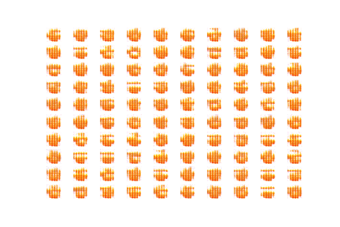
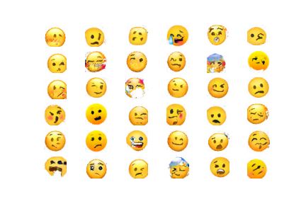
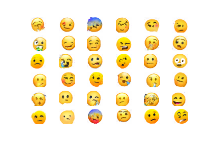
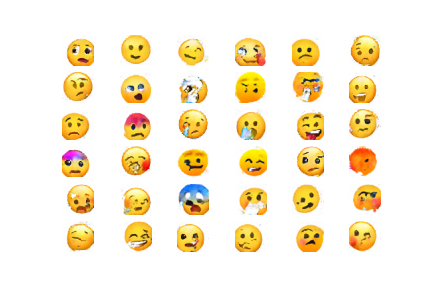
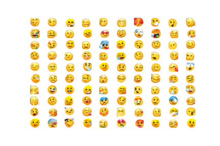

# GAN Emojis

## Models

### Training Timelapse

### Generated Samples

## Machine Setup

### Python Packages

* Keras
  * pip install keras
* TensorFlow
  * pip install tensorflow
* TensorFlow GPU
  * pip install --user --ignore-installed --upgrade tensorflow-gpu
* Scrapy
  * pip install scrapy
* Pydot
  * pip install pydot
* Matplotlib
  * pip install matplotlib
* Numpy
  * pip install numpy
* OpenCV (unused...)
  * pip install opencv-python

### Install GraphViz (required for matplotlib)

* choco install graphviz
* pip install graphviz (???)

### Install CUDA

* <https://developer.nvidia.com/cuda-downloads>
  * D:\sources\tools\CUDA\v11.2
  * D:\sources\tools\CUDA Samples\v11.2
* <https://docs.nvidia.com/deeplearning/cudnn/install-guide/index.html#installwindows>
  * Copy the 3 folders in the ZIP archive into CUDA install folder:
    * D:\sources\tools\CUDA\v11.2
* <https://www.tensorflow.org/guide/gpu#setup>
  * pip install --user --ignore-installed --upgrade tensorflow-gpu
  * [StackOverflow - Could not load dynamic library 'cusolver64_10.dll'; dlerror: cusolver64_10.dll not found](https://stackoverflow.com/questions/65608713/tensorflow-gpu-could-not-load-dynamic-library-cusolver64-10-dll-dlerror-cuso)